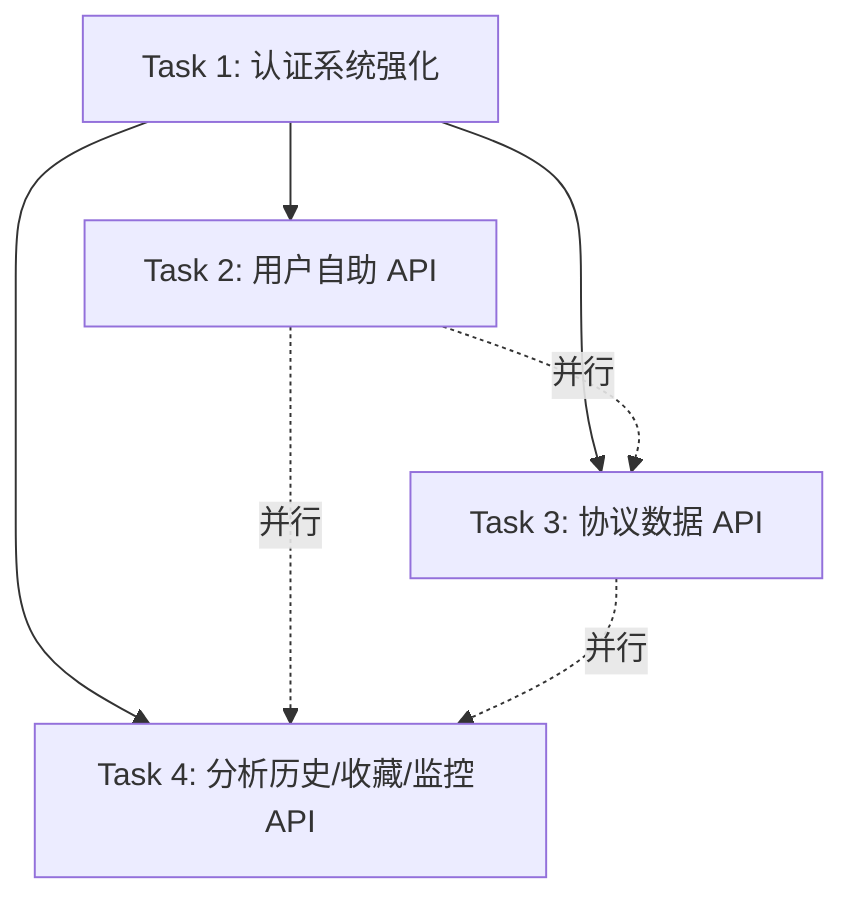

# Telegram Mini App 仪表盘 - Phase 1 后端 API 开发计划

## 概述

本文档详细规划 Phase 1 后端 API 开发的任务分解、并行策略、技术决策和验收标准。Phase 1 目标是在现有数据库架构和 Telegram 认证基础上，构建完整的 RESTful API、WebSocket 实时通信、DeFi Agent 集成和用户数据管理功能。

**工期**：2-3周（全职开发）

**技术栈**：
- 框架：FastAPI + Uvicorn
- 数据库：PostgreSQL + SQLAlchemy (async) + Alembic
- 缓存：Redis（会话存储 + 数据缓存 + Pub/Sub）
- 认证：JWT + Telegram WebApp 数据验证
- 测试：pytest + pytest-asyncio + pytest-cov
- 后台任务：asyncio + Redis 队列（可选 Celery）

**现有基础**（已完成 Phase 0）：
- ✅ 数据库表结构（users, sessions, analysis_history, favorites, watchlist）
- ✅ Alembic 迁移脚本
- ✅ 基础 Telegram 认证逻辑（`auth.py::verify_telegram_webapp_data`）
- ✅ JWT 登录端点（`/api/auth/telegram`）
- ✅ 测试数据种子脚本

---

## 任务分解

### Task 1: 认证系统强化 (auth_system_1733876801)

**优先级**：🔴 最高（其他任务依赖）

**描述**：重构现有认证逻辑为可复用模块，添加 JWT 刷新、会话撤销、依赖注入中间件和统一异常处理。

#### 文件范围

**新建文件**：
- `miniapp/backend/core/jwt.py` - JWT 工具函数（生成、验证、刷新）
- `miniapp/backend/deps.py` - FastAPI 依赖注入（获取当前用户、DB 会话）
- `miniapp/backend/core/exceptions.py` - 自定义异常类
- `miniapp/backend/core/responses.py` - 统一响应封装

**修改文件**：
- `miniapp/backend/auth.py` - 提取为纯函数模块，移除 FastAPI 耦合
- `miniapp/backend/main.py` - 提取路由到独立文件，注册异常处理器

**测试文件**：
- `miniapp/backend/tests/test_auth.py` - 认证逻辑测试（已有，需扩充）
- `miniapp/backend/tests/test_deps.py` - 依赖注入测试（新建）
- `miniapp/backend/tests/test_jwt.py` - JWT 工具测试（新建）

#### 技术决策

**1. 认证流程重构**

```python
# core/jwt.py - JWT 工具函数
from datetime import datetime, timedelta, timezone
import jwt
from typing import Optional, Dict, Any

JWT_SECRET = os.getenv("JWT_SECRET")
JWT_ALGORITHM = "HS256"
ACCESS_TOKEN_EXPIRE_MINUTES = 60
REFRESH_TOKEN_EXPIRE_DAYS = 30

def create_access_token(
    user_id: int,
    session_id: int,
    username: Optional[str] = None
) -> str:
    """生成访问 Token（包含 user_id, session_id, username）"""
    expires_at = datetime.now(timezone.utc) + timedelta(minutes=ACCESS_TOKEN_EXPIRE_MINUTES)
    payload = {
        "sub": user_id,          # 主体（用户 ID）
        "sid": session_id,       # 会话 ID（用于撤销检查）
        "username": username,
        "exp": expires_at,
        "type": "access"
    }
    return jwt.encode(payload, JWT_SECRET, algorithm=JWT_ALGORITHM)

def create_refresh_token(user_id: int, session_id: int) -> str:
    """生成刷新 Token（长期有效，用于换取新 access token）"""
    expires_at = datetime.now(timezone.utc) + timedelta(days=REFRESH_TOKEN_EXPIRE_DAYS)
    payload = {
        "sub": user_id,
        "sid": session_id,
        "exp": expires_at,
        "type": "refresh"
    }
    return jwt.encode(payload, JWT_SECRET, algorithm=JWT_ALGORITHM)

def verify_token(token: str, expected_type: str = "access") -> Optional[Dict[str, Any]]:
    """验证 Token 并返回 payload（失败返回 None）"""
    try:
        payload = jwt.decode(token, JWT_SECRET, algorithms=[JWT_ALGORITHM])
        if payload.get("type") != expected_type:
            return None
        return payload
    except jwt.ExpiredSignatureError:
        return None  # Token 过期
    except jwt.InvalidTokenError:
        return None  # Token 无效
```

**2. 依赖注入中间件**

```python
# deps.py - FastAPI 依赖注入
from fastapi import Depends, HTTPException, status
from fastapi.security import HTTPBearer, HTTPAuthorizationCredentials
from sqlalchemy.ext.asyncio import AsyncSession
from sqlalchemy import select

from db import get_session
from models import User, Session as SessionModel
from core.jwt import verify_token
from core.exceptions import AuthError

security = HTTPBearer()

async def get_current_user(
    credentials: HTTPAuthorizationCredentials = Depends(security),
    db: AsyncSession = Depends(get_session)
) -> User:
    """从 JWT Token 获取当前用户（验证会话存在且未过期）"""
    token = credentials.credentials
    payload = verify_token(token, expected_type="access")

    if not payload:
        raise AuthError("Invalid or expired token", status_code=401)

    user_id = payload.get("sub")
    session_id = payload.get("sid")

    # 检查会话是否存在且未撤销
    result = await db.execute(
        select(SessionModel)
        .where(SessionModel.id == session_id)
        .where(SessionModel.revoked_at == None)
    )
    session = result.scalar_one_or_none()
    if not session or session.expires_at < datetime.now(timezone.utc):
        raise AuthError("Session expired or revoked", status_code=401)

    # 获取用户
    result = await db.execute(select(User).where(User.id == user_id))
    user = result.scalar_one_or_none()
    if not user or user.deleted_at is not None:
        raise AuthError("User not found or deleted", status_code=401)

    # 更新最后活跃时间（可选：后台任务异步更新，避免阻塞请求）
    # await db.execute(
    #     update(User).where(User.id == user_id).values(last_active=datetime.now(timezone.utc))
    # )

    return user
```

**3. 统一异常处理**

```python
# core/exceptions.py - 领域异常类
class DomainError(Exception):
    """基类异常"""
    def __init__(self, message: str, status_code: int = 500):
        self.message = message
        self.status_code = status_code
        super().__init__(message)

class AuthError(DomainError):
    """认证/授权错误（401/403）"""
    pass

class NotFoundError(DomainError):
    """资源不存在（404）"""
    def __init__(self, resource: str, identifier: Any):
        super().__init__(f"{resource} not found: {identifier}", status_code=404)

class ValidationError(DomainError):
    """请求参数验证失败（422）"""
    def __init__(self, field: str, message: str):
        super().__init__(f"Validation failed for {field}: {message}", status_code=422)

class DataSourceError(DomainError):
    """外部数据源错误（502/503）"""
    def __init__(self, source: str, message: str):
        super().__init__(f"Data source {source} failed: {message}", status_code=502)
```

```python
# core/responses.py - 统一响应格式
from typing import Optional, Any, Dict
from pydantic import BaseModel

class ErrorDetail(BaseModel):
    code: str
    message: str

class SuccessResponse(BaseModel):
    data: Any
    error: Optional[ErrorDetail] = None

class ErrorResponse(BaseModel):
    data: Optional[Any] = None
    error: ErrorDetail

def success_response(data: Any) -> Dict:
    """成功响应"""
    return {"data": data, "error": None}

def error_response(code: str, message: str) -> Dict:
    """错误响应"""
    return {"data": None, "error": {"code": code, "message": message}}
```

```python
# main.py - 注册异常处理器
from fastapi import Request
from fastapi.responses import JSONResponse
from core.exceptions import DomainError, AuthError, NotFoundError, ValidationError

@app.exception_handler(DomainError)
async def domain_error_handler(request: Request, exc: DomainError):
    """处理领域异常"""
    return JSONResponse(
        status_code=exc.status_code,
        content=error_response(code=exc.__class__.__name__, message=exc.message)
    )

@app.exception_handler(Exception)
async def general_exception_handler(request: Request, exc: Exception):
    """捕获未处理异常（避免泄露敏感信息）"""
    logger.exception("Unhandled exception")
    return JSONResponse(
        status_code=500,
        content=error_response(code="InternalServerError", message="An unexpected error occurred")
    )
```

**4. 新增认证端点**

```python
# routers/auth.py - 认证路由
from fastapi import APIRouter, Depends
from sqlalchemy.ext.asyncio import AsyncSession

from db import get_session
from deps import get_current_user
from models import User, Session as SessionModel
from core.jwt import create_access_token, create_refresh_token, verify_token
from core.responses import success_response
from schemas.user import UserSchema

router = APIRouter(prefix="/api/auth", tags=["Authentication"])

@router.post("/telegram")
async def telegram_auth(
    request: AuthRequest,
    db: AsyncSession = Depends(get_session)
):
    """Telegram WebApp 登录（已有逻辑，移动到此）"""
    # ... 现有逻辑 ...
    access_token = create_access_token(user.id, session.id, user.username)
    refresh_token = create_refresh_token(user.id, session.id)

    return success_response({
        "user": UserSchema.model_validate(user),
        "access_token": access_token,
        "refresh_token": refresh_token,
        "expires_at": expires_at.isoformat()
    })

@router.get("/me")
async def get_current_user_info(
    current_user: User = Depends(get_current_user)
):
    """获取当前用户信息"""
    return success_response(UserSchema.model_validate(current_user))

@router.post("/refresh")
async def refresh_access_token(
    refresh_token: str,
    db: AsyncSession = Depends(get_session)
):
    """使用刷新 Token 获取新的 access token"""
    payload = verify_token(refresh_token, expected_type="refresh")
    if not payload:
        raise AuthError("Invalid refresh token", status_code=401)

    session_id = payload.get("sid")
    result = await db.execute(
        select(SessionModel).where(SessionModel.id == session_id)
    )
    session = result.scalar_one_or_none()
    if not session or session.revoked_at is not None:
        raise AuthError("Session revoked", status_code=401)

    new_access_token = create_access_token(
        session.user_id,
        session.id,
        session.user.username
    )

    return success_response({
        "access_token": new_access_token,
        "expires_at": (datetime.now(timezone.utc) + timedelta(minutes=60)).isoformat()
    })

@router.post("/logout")
async def logout(
    current_user: User = Depends(get_current_user),
    db: AsyncSession = Depends(get_session)
):
    """登出（撤销当前会话）"""
    # 从 Token 获取 session_id 并标记为已撤销
    # 需要从 request headers 获取 token 并解析 sid
    # 简化实现：撤销用户的所有会话
    await db.execute(
        update(SessionModel)
        .where(SessionModel.user_id == current_user.id)
        .where(SessionModel.revoked_at == None)
        .values(revoked_at=datetime.now(timezone.utc))
    )
    await db.commit()

    return success_response({"message": "Logged out successfully"})
```

#### 测试命令

```bash
pytest miniapp/backend/tests/test_auth.py \
      miniapp/backend/tests/test_deps.py \
      miniapp/backend/tests/test_jwt.py \
      --cov=miniapp/backend/auth.py \
      --cov=miniapp/backend/core/jwt.py \
      --cov=miniapp/backend/deps.py \
      --cov=miniapp/backend/routers/auth.py \
      --cov-report=term \
      --cov-report=html \
      -v
```

#### 测试覆盖重点

- ✅ Telegram 数据验证（有效/无效签名/过期/重放攻击）
- ✅ JWT 生成和验证（access/refresh token）
- ✅ 会话检查（有效/过期/撤销）
- ✅ 依赖注入（有 Token/无 Token/无效 Token/过期 Token）
- ✅ 异常处理（返回正确状态码和错误格式）
- ✅ 刷新流程（refresh token → 新 access token）
- ✅ 登出流程（撤销会话）

#### 交付物

- ✅ `/api/auth/telegram` - Telegram 登录（返回 access_token + refresh_token）
- ✅ `/api/auth/me` - 获取当前用户信息（需要认证）
- ✅ `/api/auth/refresh` - 刷新 Token
- ✅ `/api/auth/logout` - 登出（撤销会话）
- ✅ `get_current_user` 依赖注入函数（用于其他路由）
- ✅ 统一响应格式 `{data, error}`
- ✅ 测试覆盖率 ≥90%

---

### Task 2: 用户自助 API (user_api_1733876802)

**优先级**：🟡 中等（依赖 Task 1）

**描述**：实现用户自助管理端点，包括获取/更新个人信息、偏好设置、统计数据和账户软删除。

#### 文件范围

**新建文件**：
- `miniapp/backend/routers/users.py` - 用户路由
- `miniapp/backend/crud/user.py` - 用户数据库操作
- `miniapp/backend/tests/test_users.py` - 用户 API 测试

**修改文件**：
- `miniapp/backend/schemas/user.py` - 添加 UserSettingsSchema, UserStatsSchema

#### 技术决策

**1. Schema 设计**

```python
# schemas/user.py - 更新 Schema
from pydantic import BaseModel, Field
from typing import Optional, Dict, Any
from datetime import datetime

class UserSettingsSchema(BaseModel):
    """用户设置（存储在 users.settings JSON 字段）"""
    risk_preference: str = Field(default="medium", pattern="^(low|medium|high)$")
    default_analysis_params: Optional[Dict[str, Any]] = None
    notification_enabled: bool = True
    language: str = "zh"

class UserStatsSchema(BaseModel):
    """用户统计数据"""
    total_analysis: int
    favorites_count: int
    watchlist_count: int
    last_analysis_date: Optional[datetime]

class UserUpdateRequest(BaseModel):
    """用户信息更新请求"""
    first_name: Optional[str] = None
    last_name: Optional[str] = None
    language_code: Optional[str] = None

class UserSettingsUpdateRequest(BaseModel):
    """用户设置更新请求"""
    settings: UserSettingsSchema
```

**2. CRUD 层**

```python
# crud/user.py - 用户数据操作
from sqlalchemy.ext.asyncio import AsyncSession
from sqlalchemy import select, func
from sqlalchemy.orm import selectinload

from models import User, Analysis, Favorite, Watchlist
from schemas.user import UserStatsSchema, UserSettingsSchema
from core.exceptions import NotFoundError

async def get_user_stats(user_id: int, db: AsyncSession) -> UserStatsSchema:
    """获取用户统计数据"""
    # 分析总数
    analysis_count = await db.scalar(
        select(func.count(Analysis.id)).where(Analysis.user_id == user_id)
    )

    # 收藏数
    favorites_count = await db.scalar(
        select(func.count(Favorite.id)).where(Favorite.user_id == user_id)
    )

    # 监控数
    watchlist_count = await db.scalar(
        select(func.count(Watchlist.id)).where(Watchlist.user_id == user_id)
    )

    # 最后分析日期
    last_analysis = await db.scalar(
        select(func.max(Analysis.created_at)).where(Analysis.user_id == user_id)
    )

    return UserStatsSchema(
        total_analysis=analysis_count or 0,
        favorites_count=favorites_count or 0,
        watchlist_count=watchlist_count or 0,
        last_analysis_date=last_analysis
    )

async def update_user_settings(
    user_id: int,
    settings: UserSettingsSchema,
    db: AsyncSession
) -> User:
    """更新用户设置（验证 settings 字段）"""
    result = await db.execute(select(User).where(User.id == user_id))
    user = result.scalar_one_or_none()
    if not user:
        raise NotFoundError("User", user_id)

    # 合并现有设置和新设置
    current_settings = user.settings or {}
    updated_settings = {**current_settings, **settings.model_dump(exclude_none=True)}

    user.settings = updated_settings
    await db.commit()
    await db.refresh(user)
    return user

async def soft_delete_user(user_id: int, db: AsyncSession) -> None:
    """软删除用户（标记 deleted_at）"""
    result = await db.execute(select(User).where(User.id == user_id))
    user = result.scalar_one_or_none()
    if not user:
        raise NotFoundError("User", user_id)

    user.deleted_at = datetime.now(timezone.utc)
    await db.commit()
```

**3. 路由实现**

```python
# routers/users.py - 用户路由
from fastapi import APIRouter, Depends
from sqlalchemy.ext.asyncio import AsyncSession

from db import get_session
from deps import get_current_user
from models import User
from schemas.user import (
    UserSchema,
    UserUpdateRequest,
    UserSettingsUpdateRequest,
    UserStatsSchema
)
from crud.user import get_user_stats, update_user_settings, soft_delete_user
from core.responses import success_response

router = APIRouter(prefix="/api/users", tags=["Users"])

@router.get("/me")
async def get_my_profile(current_user: User = Depends(get_current_user)):
    """获取当前用户详细信息"""
    return success_response(UserSchema.model_validate(current_user))

@router.patch("/me")
async def update_my_profile(
    request: UserUpdateRequest,
    current_user: User = Depends(get_current_user),
    db: AsyncSession = Depends(get_session)
):
    """更新用户信息（仅允许更新部分字段）"""
    if request.first_name:
        current_user.first_name = request.first_name
    if request.last_name:
        current_user.last_name = request.last_name
    if request.language_code:
        current_user.language_code = request.language_code

    await db.commit()
    await db.refresh(current_user)
    return success_response(UserSchema.model_validate(current_user))

@router.get("/me/settings")
async def get_my_settings(current_user: User = Depends(get_current_user)):
    """获取用户设置"""
    return success_response(current_user.settings or {})

@router.patch("/me/settings")
async def update_my_settings(
    request: UserSettingsUpdateRequest,
    current_user: User = Depends(get_current_user),
    db: AsyncSession = Depends(get_session)
):
    """更新用户设置（验证 settings 字段）"""
    user = await update_user_settings(current_user.id, request.settings, db)
    return success_response(user.settings)

@router.get("/me/stats")
async def get_my_stats(
    current_user: User = Depends(get_current_user),
    db: AsyncSession = Depends(get_session)
):
    """获取用户统计信息"""
    stats = await get_user_stats(current_user.id, db)
    return success_response(stats.model_dump())

@router.delete("/me")
async def delete_my_account(
    current_user: User = Depends(get_current_user),
    db: AsyncSession = Depends(get_session)
):
    """删除账户（软删除）"""
    await soft_delete_user(current_user.id, db)
    return success_response({"message": "Account deleted successfully"})
```

#### 测试命令

```bash
pytest miniapp/backend/tests/test_users.py \
      --cov=miniapp/backend/routers/users.py \
      --cov=miniapp/backend/crud/user.py \
      --cov-report=term \
      -v
```

#### 测试覆盖重点

- ✅ 获取用户信息（认证用户）
- ✅ 更新用户信息（部分字段）
- ✅ 获取和更新设置（验证 risk_preference 枚举）
- ✅ 获取统计数据（正确计算）
- ✅ 软删除账户（标记 deleted_at）
- ✅ 未认证访问返回 401

#### 交付物

- ✅ `GET /api/users/me` - 获取当前用户详细信息
- ✅ `PATCH /api/users/me` - 更新用户信息
- ✅ `GET /api/users/me/settings` - 获取用户设置
- ✅ `PATCH /api/users/me/settings` - 更新用户设置
- ✅ `GET /api/users/me/stats` - 获取用户统计信息
- ✅ `DELETE /api/users/me` - 删除账户（软删除）
- ✅ 测试覆盖率 ≥90%

---

### Task 3: 协议数据 API (protocol_data_1733876803)

**优先级**：🟡 中等（依赖 Task 1，可与 Task 2 并行）

**描述**：异步封装现有 DeFi 数据源（DeFi Llama, The Graph, CoinGecko），提供协议列表/详情/历史/市场数据/池数据/触发分析的 RESTful 接口，实现缓存和多源回退。

#### 文件范围

**新建文件**：
- `miniapp/backend/services/defi_data.py` - DeFi 数据服务（异步封装）
- `miniapp/backend/routers/protocols.py` - 协议路由
- `miniapp/backend/services/agent.py` - Agent 集成服务（可选，简化为直接调用）
- `miniapp/backend/tests/test_protocols.py` - 协议 API 测试
- `miniapp/backend/tests/mocks/defi_responses.py` - HTTP 响应 Mock

**依赖文件**（复用）：
- `defiagents/dataflows/defi/defillama.py` - DeFi Llama 客户端
- `defiagents/dataflows/defi/the_graph.py` - The Graph 客户端
- `defiagents/dataflows/defi/coingecko.py` - CoinGecko 客户端

#### 技术决策

**1. 异步数据源封装**

```python
# services/defi_data.py - DeFi 数据服务
import asyncio
from typing import Optional, List, Dict, Any
from functools import lru_cache
import aioredis
import json

# 导入现有同步数据源
from defiagents.dataflows.defi.defillama import (
    get_protocol_tvl,
    get_protocol_info,
    _normalize_tvl
)
from defiagents.dataflows.defi.the_graph import get_uniswap_pool_details
from defiagents.dataflows.defi.coingecko import get_token_price

from core.exceptions import DataSourceError

class DeFiDataService:
    """DeFi 数据聚合服务（异步 + 多源回退 + 缓存）"""

    def __init__(self, redis_url: Optional[str] = None):
        self.redis = None
        if redis_url:
            self.redis = aioredis.from_url(redis_url, decode_responses=True)

    async def _run_sync(self, func, *args, **kwargs):
        """在线程池中运行同步函数"""
        loop = asyncio.get_event_loop()
        return await loop.run_in_executor(None, func, *args, **kwargs)

    async def _get_cached(self, key: str) -> Optional[Any]:
        """从 Redis 获取缓存"""
        if not self.redis:
            return None
        try:
            cached = await self.redis.get(key)
            return json.loads(cached) if cached else None
        except Exception:
            return None

    async def _set_cached(self, key: str, value: Any, ttl: int = 300):
        """写入 Redis 缓存（默认 5 分钟）"""
        if not self.redis:
            return
        try:
            await self.redis.setex(key, ttl, json.dumps(value))
        except Exception:
            pass

    async def get_protocol_summary(self, protocol: str) -> Dict[str, Any]:
        """获取协议摘要（TVL, APY, 风险评分）"""
        cache_key = f"protocol:summary:{protocol}"
        cached = await self._get_cached(cache_key)
        if cached:
            return cached

        try:
            # 优先 DeFi Llama
            tvl_raw = await self._run_sync(get_protocol_tvl, protocol)
            tvl = _normalize_tvl(tvl_raw)

            # 获取协议详细信息（同步调用）
            info = await self._run_sync(get_protocol_info, protocol)

            summary = {
                "name": protocol,
                "tvl": tvl,
                "apy": info.get("apy", 0),  # 需要额外数据源
                "risk_score": 5.0,  # 占位符，需要风险评分模型
                "category": info.get("category"),
                "chains": info.get("chains", [])
            }

            await self._set_cached(cache_key, summary, ttl=300)
            return summary

        except Exception as e:
            raise DataSourceError("DeFi Llama", str(e))

    async def get_protocol_history(
        self,
        protocol: str,
        days: int = 30
    ) -> List[Dict[str, Any]]:
        """获取历史 TVL 数据"""
        cache_key = f"protocol:history:{protocol}:{days}"
        cached = await self._get_cached(cache_key)
        if cached:
            return cached

        try:
            # 调用现有数据源（需要实现异步版本或线程池）
            history = await self._run_sync(get_protocol_tvl_history, protocol, days)
            await self._set_cached(cache_key, history, ttl=3600)  # 1小时缓存
            return history
        except Exception as e:
            raise DataSourceError("DeFi Llama", str(e))

    async def search_protocols(
        self,
        query: str,
        category: Optional[str] = None,
        chain: Optional[str] = None,
        limit: int = 20
    ) -> List[Dict[str, Any]]:
        """搜索协议（支持模糊匹配和筛选）"""
        cache_key = f"protocols:search:{query}:{category}:{chain}:{limit}"
        cached = await self._get_cached(cache_key)
        if cached:
            return cached

        try:
            # 获取协议列表（需要实现搜索逻辑）
            protocols = await self._run_sync(search_defi_protocols, query, category, chain, limit)
            await self._set_cached(cache_key, protocols, ttl=600)
            return protocols
        except Exception as e:
            raise DataSourceError("DeFi Llama", str(e))

    async def get_pool_details(
        self,
        protocol: str,
        pool_id: str
    ) -> Dict[str, Any]:
        """获取流动性池详情（The Graph 数据）"""
        cache_key = f"pool:details:{protocol}:{pool_id}"
        cached = await self._get_cached(cache_key)
        if cached:
            return cached

        try:
            # 调用 The Graph 子图
            if protocol.startswith("uniswap"):
                details = await self._run_sync(get_uniswap_pool_details, pool_id)
            else:
                raise DataSourceError("The Graph", f"Unsupported protocol: {protocol}")

            await self._set_cached(cache_key, details, ttl=60)  # 1分钟缓存
            return details
        except Exception as e:
            raise DataSourceError("The Graph", str(e))

    async def get_market_data(
        self,
        token_symbol: str
    ) -> Dict[str, Any]:
        """获取代币市场数据（价格、市值、24h 变化）"""
        cache_key = f"market:token:{token_symbol}"
        cached = await self._get_cached(cache_key)
        if cached:
            return cached

        try:
            # 调用 CoinGecko
            price_data = await self._run_sync(get_token_price, token_symbol)
            await self._set_cached(cache_key, price_data, ttl=60)
            return price_data
        except Exception as e:
            raise DataSourceError("CoinGecko", str(e))
```

**2. 路由实现**

```python
# routers/protocols.py - 协议路由
from fastapi import APIRouter, Depends, Query
from typing import Optional, List

from services.defi_data import DeFiDataService
from core.responses import success_response
from deps import get_current_user
from models import User

router = APIRouter(prefix="/api/protocols", tags=["Protocols"])

# 服务单例（启动时初始化）
defi_service = DeFiDataService(redis_url=os.getenv("REDIS_URL"))

@router.get("")
async def list_protocols(
    query: Optional[str] = None,
    category: Optional[str] = None,
    chain: Optional[str] = None,
    limit: int = Query(default=20, le=100),
    offset: int = Query(default=0, ge=0),
    current_user: User = Depends(get_current_user)
):
    """协议列表（支持搜索和筛选）"""
    protocols = await defi_service.search_protocols(query, category, chain, limit)
    return success_response({
        "protocols": protocols[offset:offset+limit],
        "pagination": {
            "total": len(protocols),
            "limit": limit,
            "offset": offset
        }
    })

@router.get("/{protocol_name}")
async def get_protocol_detail(
    protocol_name: str,
    current_user: User = Depends(get_current_user)
):
    """协议详情（摘要 + 最新数据）"""
    summary = await defi_service.get_protocol_summary(protocol_name)
    return success_response(summary)

@router.get("/{protocol_name}/history")
async def get_protocol_history(
    protocol_name: str,
    days: int = Query(default=30, ge=1, le=365),
    current_user: User = Depends(get_current_user)
):
    """协议历史数据（TVL 趋势）"""
    history = await defi_service.get_protocol_history(protocol_name, days)
    return success_response(history)

@router.get("/{protocol_name}/pools")
async def get_protocol_pools(
    protocol_name: str,
    current_user: User = Depends(get_current_user)
):
    """协议流动性池列表"""
    # 占位符实现，需要根据协议类型调用不同数据源
    return success_response([])

@router.get("/{protocol_name}/pools/{pool_id}")
async def get_pool_detail(
    protocol_name: str,
    pool_id: str,
    current_user: User = Depends(get_current_user)
):
    """流动性池详情"""
    details = await defi_service.get_pool_details(protocol_name, pool_id)
    return success_response(details)

@router.get("/market/{token_symbol}")
async def get_token_market_data(
    token_symbol: str,
    current_user: User = Depends(get_current_user)
):
    """代币市场数据"""
    data = await defi_service.get_market_data(token_symbol)
    return success_response(data)

@router.post("/{protocol_name}/analyze")
async def trigger_analysis(
    protocol_name: str,
    current_user: User = Depends(get_current_user)
):
    """触发 Agent 分析（异步任务，返回任务 ID）"""
    # 将在 Task 4 中实现完整逻辑
    return success_response({"task_id": "placeholder", "status": "pending"})
```

#### 测试命令

```bash
pytest miniapp/backend/tests/test_protocols.py \
      --cov=miniapp/backend/services/defi_data.py \
      --cov=miniapp/backend/routers/protocols.py \
      --cov-report=term \
      -v
```

#### 测试覆盖重点

- ✅ 协议列表（分页、搜索、筛选）
- ✅ 协议详情（正确返回 TVL/APY）
- ✅ 历史数据（正确解析日期和数值）
- ✅ 池详情（The Graph 数据）
- ✅ 市场数据（CoinGecko）
- ✅ 缓存命中（Mock Redis）
- ✅ 数据源失败回退（Mock HTTP 错误）
- ✅ 未认证访问返回 401

#### 交付物

- ✅ `GET /api/protocols` - 协议列表（分页、搜索、筛选）
- ✅ `GET /api/protocols/{name}` - 协议详情
- ✅ `GET /api/protocols/{name}/history` - 历史数据
- ✅ `GET /api/protocols/{name}/pools` - 流动性池列表
- ✅ `GET /api/protocols/{name}/pools/{pool_id}` - 池详情
- ✅ `GET /api/protocols/market/{token}` - 代币市场数据
- ✅ `POST /api/protocols/{name}/analyze` - 触发分析（占位符）
- ✅ 缓存机制（Redis + TTL）
- ✅ 多源回退（DeFi Llama → The Graph → 失败）
- ✅ 测试覆盖率 ≥90%

---

### Task 4: 分析历史/收藏/监控 API (records_fav_watch_1733876804)

**优先级**：🟡 中等（依赖 Task 1，可与 Task 2/3 并行）

**描述**：实现分析历史 CRUD（offset 分页、搜索）、收藏 CRUD、监控 CRUD 和警报条件管理，添加缺失的 Pydantic Schema，共享分页助手。

#### 文件范围

**新建文件**：
- `miniapp/backend/schemas/watchlist.py` - 监控 Schema
- `miniapp/backend/routers/analysis_history.py` - 分析历史路由
- `miniapp/backend/routers/favorites.py` - 收藏路由
- `miniapp/backend/routers/watchlist.py` - 监控路由
- `miniapp/backend/crud/analysis.py` - 分析历史 CRUD
- `miniapp/backend/crud/favorite.py` - 收藏 CRUD
- `miniapp/backend/crud/watchlist.py` - 监控 CRUD
- `miniapp/backend/utils/pagination.py` - 分页助手
- `miniapp/backend/tests/test_records.py` - 分析历史测试
- `miniapp/backend/tests/test_favorites_watchlist.py` - 收藏/监控测试

#### 技术决策

**1. 分页助手**

```python
# utils/pagination.py - 分页助手
from typing import TypeVar, Generic, List
from pydantic import BaseModel

T = TypeVar('T')

class PaginatedResponse(BaseModel, Generic[T]):
    """分页响应模型"""
    data: List[T]
    pagination: dict

def paginate(
    items: List[T],
    total: int,
    limit: int,
    offset: int
) -> PaginatedResponse[T]:
    """生成分页响应"""
    return PaginatedResponse(
        data=items,
        pagination={
            "total": total,
            "limit": limit,
            "offset": offset,
            "has_more": offset + limit < total
        }
    )
```

**2. Schema 定义**

```python
# schemas/watchlist.py - 监控 Schema
from pydantic import BaseModel, Field
from typing import Optional, Dict, Any
from datetime import datetime

class WatchlistCreateRequest(BaseModel):
    protocol_name: str
    conditions: Dict[str, Any] = Field(
        default_factory=dict,
        description="警报条件，如 {'tvl_change_pct': 10, 'apy_threshold': 5}"
    )

class WatchlistUpdateRequest(BaseModel):
    conditions: Optional[Dict[str, Any]] = None
    enabled: Optional[bool] = None

class WatchlistSchema(BaseModel):
    id: int
    user_id: int
    protocol_name: str
    conditions: Dict[str, Any]
    enabled: bool
    created_at: datetime
    updated_at: datetime

    class Config:
        from_attributes = True
```

**3. CRUD 实现**

```python
# crud/analysis.py - 分析历史 CRUD
from sqlalchemy.ext.asyncio import AsyncSession
from sqlalchemy import select, func, or_
from typing import List, Optional

from models import Analysis
from core.exceptions import NotFoundError

async def create_analysis_record(
    user_id: int,
    protocol: str,
    query: str,
    result: dict,
    db: AsyncSession
) -> Analysis:
    """创建分析记录"""
    analysis = Analysis(
        user_id=user_id,
        protocol_name=protocol,
        query_type=query,
        result=result
    )
    db.add(analysis)
    await db.commit()
    await db.refresh(analysis)
    return analysis

async def get_user_analysis_history(
    user_id: int,
    limit: int,
    offset: int,
    protocol_filter: Optional[str] = None,
    query_type_filter: Optional[str] = None,
    db: AsyncSession
) -> tuple[List[Analysis], int]:
    """获取用户分析历史（支持筛选和分页）"""
    query = select(Analysis).where(Analysis.user_id == user_id)

    if protocol_filter:
        query = query.where(Analysis.protocol_name.ilike(f"%{protocol_filter}%"))
    if query_type_filter:
        query = query.where(Analysis.query_type == query_type_filter)

    # 总数
    total_query = select(func.count()).select_from(query.subquery())
    total = await db.scalar(total_query)

    # 分页数据
    query = query.order_by(Analysis.created_at.desc()).limit(limit).offset(offset)
    result = await db.execute(query)
    items = result.scalars().all()

    return items, total or 0

async def get_analysis_by_id(
    analysis_id: int,
    user_id: int,
    db: AsyncSession
) -> Analysis:
    """获取单条分析记录（验证所属用户）"""
    result = await db.execute(
        select(Analysis)
        .where(Analysis.id == analysis_id)
        .where(Analysis.user_id == user_id)
    )
    analysis = result.scalar_one_or_none()
    if not analysis:
        raise NotFoundError("Analysis", analysis_id)
    return analysis

async def delete_analysis(
    analysis_id: int,
    user_id: int,
    db: AsyncSession
) -> None:
    """删除分析记录（验证所属用户）"""
    analysis = await get_analysis_by_id(analysis_id, user_id, db)
    await db.delete(analysis)
    await db.commit()
```

```python
# crud/favorite.py - 收藏 CRUD
from sqlalchemy.ext.asyncio import AsyncSession
from sqlalchemy import select
from typing import List

from models import Favorite
from core.exceptions import NotFoundError, ValidationError

async def add_favorite(
    user_id: int,
    protocol_name: str,
    db: AsyncSession
) -> Favorite:
    """添加收藏（检查重复）"""
    # 检查是否已收藏
    existing = await db.execute(
        select(Favorite)
        .where(Favorite.user_id == user_id)
        .where(Favorite.protocol_name == protocol_name)
    )
    if existing.scalar_one_or_none():
        raise ValidationError("protocol_name", "Already favorited")

    favorite = Favorite(user_id=user_id, protocol_name=protocol_name)
    db.add(favorite)
    await db.commit()
    await db.refresh(favorite)
    return favorite

async def get_user_favorites(
    user_id: int,
    db: AsyncSession
) -> List[Favorite]:
    """获取用户收藏列表"""
    result = await db.execute(
        select(Favorite)
        .where(Favorite.user_id == user_id)
        .order_by(Favorite.created_at.desc())
    )
    return result.scalars().all()

async def remove_favorite(
    user_id: int,
    protocol_name: str,
    db: AsyncSession
) -> None:
    """取消收藏"""
    result = await db.execute(
        select(Favorite)
        .where(Favorite.user_id == user_id)
        .where(Favorite.protocol_name == protocol_name)
    )
    favorite = result.scalar_one_or_none()
    if not favorite:
        raise NotFoundError("Favorite", protocol_name)

    await db.delete(favorite)
    await db.commit()
```

```python
# crud/watchlist.py - 监控 CRUD
from sqlalchemy.ext.asyncio import AsyncSession
from sqlalchemy import select
from typing import List, Dict, Any

from models import Watchlist
from core.exceptions import NotFoundError

async def create_watchlist(
    user_id: int,
    protocol_name: str,
    conditions: Dict[str, Any],
    db: AsyncSession
) -> Watchlist:
    """创建监控项"""
    watchlist = Watchlist(
        user_id=user_id,
        protocol_name=protocol_name,
        conditions=conditions,
        enabled=True
    )
    db.add(watchlist)
    await db.commit()
    await db.refresh(watchlist)
    return watchlist

async def get_user_watchlist(
    user_id: int,
    db: AsyncSession
) -> List[Watchlist]:
    """获取用户监控列表"""
    result = await db.execute(
        select(Watchlist)
        .where(Watchlist.user_id == user_id)
        .order_by(Watchlist.created_at.desc())
    )
    return result.scalars().all()

async def update_watchlist(
    watchlist_id: int,
    user_id: int,
    conditions: Optional[Dict[str, Any]],
    enabled: Optional[bool],
    db: AsyncSession
) -> Watchlist:
    """更新监控项（条件或启用状态）"""
    result = await db.execute(
        select(Watchlist)
        .where(Watchlist.id == watchlist_id)
        .where(Watchlist.user_id == user_id)
    )
    watchlist = result.scalar_one_or_none()
    if not watchlist:
        raise NotFoundError("Watchlist", watchlist_id)

    if conditions is not None:
        watchlist.conditions = conditions
    if enabled is not None:
        watchlist.enabled = enabled

    await db.commit()
    await db.refresh(watchlist)
    return watchlist

async def delete_watchlist(
    watchlist_id: int,
    user_id: int,
    db: AsyncSession
) -> None:
    """删除监控项"""
    result = await db.execute(
        select(Watchlist)
        .where(Watchlist.id == watchlist_id)
        .where(Watchlist.user_id == user_id)
    )
    watchlist = result.scalar_one_or_none()
    if not watchlist:
        raise NotFoundError("Watchlist", watchlist_id)

    await db.delete(watchlist)
    await db.commit()
```

**4. 路由实现**

```python
# routers/analysis_history.py - 分析历史路由
from fastapi import APIRouter, Depends, Query
from sqlalchemy.ext.asyncio import AsyncSession
from typing import Optional

from db import get_session
from deps import get_current_user
from models import User
from schemas.analysis import AnalysisSchema
from crud.analysis import (
    get_user_analysis_history,
    get_analysis_by_id,
    delete_analysis
)
from core.responses import success_response
from utils.pagination import paginate

router = APIRouter(prefix="/api/analysis/history", tags=["Analysis History"])

@router.get("")
async def list_analysis_history(
    limit: int = Query(default=20, le=100),
    offset: int = Query(default=0, ge=0),
    protocol: Optional[str] = None,
    query_type: Optional[str] = None,
    current_user: User = Depends(get_current_user),
    db: AsyncSession = Depends(get_session)
):
    """获取分析历史（支持分页和筛选）"""
    items, total = await get_user_analysis_history(
        current_user.id, limit, offset, protocol, query_type, db
    )
    return success_response(paginate(
        [AnalysisSchema.model_validate(item) for item in items],
        total, limit, offset
    ))

@router.get("/{analysis_id}")
async def get_analysis_detail(
    analysis_id: int,
    current_user: User = Depends(get_current_user),
    db: AsyncSession = Depends(get_session)
):
    """获取单条分析详情"""
    analysis = await get_analysis_by_id(analysis_id, current_user.id, db)
    return success_response(AnalysisSchema.model_validate(analysis))

@router.delete("/{analysis_id}")
async def delete_analysis_record(
    analysis_id: int,
    current_user: User = Depends(get_current_user),
    db: AsyncSession = Depends(get_session)
):
    """删除分析记录"""
    await delete_analysis(analysis_id, current_user.id, db)
    return success_response({"message": "Analysis deleted"})
```

```python
# routers/favorites.py - 收藏路由
from fastapi import APIRouter, Depends
from sqlalchemy.ext.asyncio import AsyncSession

from db import get_session
from deps import get_current_user
from models import User
from schemas.favorite import FavoriteSchema, FavoriteCreateRequest
from crud.favorite import add_favorite, get_user_favorites, remove_favorite
from core.responses import success_response

router = APIRouter(prefix="/api/favorites", tags=["Favorites"])

@router.get("")
async def list_favorites(
    current_user: User = Depends(get_current_user),
    db: AsyncSession = Depends(get_session)
):
    """获取收藏列表"""
    favorites = await get_user_favorites(current_user.id, db)
    return success_response([FavoriteSchema.model_validate(f) for f in favorites])

@router.post("")
async def create_favorite(
    request: FavoriteCreateRequest,
    current_user: User = Depends(get_current_user),
    db: AsyncSession = Depends(get_session)
):
    """添加收藏"""
    favorite = await add_favorite(current_user.id, request.protocol_name, db)
    return success_response(FavoriteSchema.model_validate(favorite))

@router.delete("/{protocol_name}")
async def delete_favorite(
    protocol_name: str,
    current_user: User = Depends(get_current_user),
    db: AsyncSession = Depends(get_session)
):
    """取消收藏"""
    await remove_favorite(current_user.id, protocol_name, db)
    return success_response({"message": "Favorite removed"})
```

```python
# routers/watchlist.py - 监控路由
from fastapi import APIRouter, Depends
from sqlalchemy.ext.asyncio import AsyncSession

from db import get_session
from deps import get_current_user
from models import User
from schemas.watchlist import (
    WatchlistSchema,
    WatchlistCreateRequest,
    WatchlistUpdateRequest
)
from crud.watchlist import (
    create_watchlist,
    get_user_watchlist,
    update_watchlist,
    delete_watchlist
)
from core.responses import success_response

router = APIRouter(prefix="/api/watchlist", tags=["Watchlist"])

@router.get("")
async def list_watchlist(
    current_user: User = Depends(get_current_user),
    db: AsyncSession = Depends(get_session)
):
    """获取监控列表"""
    watchlist = await get_user_watchlist(current_user.id, db)
    return success_response([WatchlistSchema.model_validate(w) for w in watchlist])

@router.post("")
async def create_watchlist_item(
    request: WatchlistCreateRequest,
    current_user: User = Depends(get_current_user),
    db: AsyncSession = Depends(get_session)
):
    """添加监控"""
    item = await create_watchlist(
        current_user.id,
        request.protocol_name,
        request.conditions,
        db
    )
    return success_response(WatchlistSchema.model_validate(item))

@router.patch("/{watchlist_id}")
async def update_watchlist_item(
    watchlist_id: int,
    request: WatchlistUpdateRequest,
    current_user: User = Depends(get_current_user),
    db: AsyncSession = Depends(get_session)
):
    """更新监控条件或状态"""
    item = await update_watchlist(
        watchlist_id,
        current_user.id,
        request.conditions,
        request.enabled,
        db
    )
    return success_response(WatchlistSchema.model_validate(item))

@router.delete("/{watchlist_id}")
async def delete_watchlist_item(
    watchlist_id: int,
    current_user: User = Depends(get_current_user),
    db: AsyncSession = Depends(get_session)
):
    """删除监控"""
    await delete_watchlist(watchlist_id, current_user.id, db)
    return success_response({"message": "Watchlist item deleted"})
```

#### 测试命令

```bash
pytest miniapp/backend/tests/test_records.py \
      miniapp/backend/tests/test_favorites_watchlist.py \
      --cov=miniapp/backend/routers/analysis_history.py \
      --cov=miniapp/backend/routers/favorites.py \
      --cov=miniapp/backend/routers/watchlist.py \
      --cov=miniapp/backend/crud/analysis.py \
      --cov=miniapp/backend/crud/favorite.py \
      --cov=miniapp/backend/crud/watchlist.py \
      --cov-report=term \
      -v
```

#### 测试覆盖重点

- ✅ 分析历史分页（limit/offset）
- ✅ 分析历史筛选（协议名称、查询类型）
- ✅ 获取单条分析详情（验证所属用户）
- ✅ 删除分析记录（验证所属用户）
- ✅ 添加收藏（检查重复）
- ✅ 获取收藏列表
- ✅ 取消收藏
- ✅ 创建监控（验证 conditions）
- ✅ 更新监控条件
- ✅ 删除监控（验证所属用户）
- ✅ 未认证访问返回 401

#### 交付物

- ✅ `GET /api/analysis/history` - 分析历史列表（分页、筛选）
- ✅ `GET /api/analysis/history/{id}` - 分析详情
- ✅ `DELETE /api/analysis/history/{id}` - 删除分析记录
- ✅ `GET /api/favorites` - 收藏列表
- ✅ `POST /api/favorites` - 添加收藏
- ✅ `DELETE /api/favorites/{protocol}` - 取消收藏
- ✅ `GET /api/watchlist` - 监控列表
- ✅ `POST /api/watchlist` - 添加监控
- ✅ `PATCH /api/watchlist/{id}` - 更新监控条件
- ✅ `DELETE /api/watchlist/{id}` - 删除监控
- ✅ 分页助手函数
- ✅ 测试覆盖率 ≥90%

---

## 并行化策略



**执行顺序**：
1. **Week 1-2**：完成 Task 1（认证系统，所有任务依赖）
2. **Week 2-3**：并行开发 Task 2/3/4（3个开发者可同时工作）

**依赖关系**：
- Task 2/3/4 都依赖 Task 1 的 `get_current_user` 依赖注入
- Task 2/3/4 之间无依赖，可完全并行

---

## 验收标准

### 功能验收

- ✅ 所有端点按 RESTful 规范实现
- ✅ 统一响应格式 `{data, error}`
- ✅ 分页响应包含 `pagination: {total, limit, offset, has_more}`
- ✅ 时间戳使用 ISO8601 格式（UTC）
- ✅ 错误响应包含明确的状态码和错误信息

### 质量验收

- ✅ 测试覆盖率 ≥90%（新模块）
- ✅ 所有 API 端点有对应测试
- ✅ 缓存命中/未命中场景测试
- ✅ 异常处理测试（401/403/404/422/500）
- ✅ 数据源失败回退测试

### 性能验收

- ✅ 缓存命中响应时间 <200ms
- ✅ 数据源查询响应时间 <2s
- ✅ 数据库查询使用索引（EXPLAIN 检查）
- ✅ 分页查询优化（LIMIT + OFFSET）

### 文档验收

- ✅ OpenAPI 自动生成文档（FastAPI 内置）
- ✅ 每个端点有清晰的 docstring
- ✅ Schema 有 description 和 example

---

## 技术约束

### 1. 数据库查询优化

**要求**：所有查询必须使用索引，避免全表扫描。

**检查命令**：
```sql
-- PostgreSQL 查看查询执行计划
EXPLAIN ANALYZE SELECT * FROM analysis_history WHERE user_id = 1;
```

**关键索引**（已在 Phase 0 创建）：
- `users(telegram_id)` - 唯一索引
- `sessions(user_id, expires_at)` - 复合索引
- `analysis_history(user_id, created_at)` - 复合索引
- `favorites(user_id, protocol_name)` - 唯一复合索引
- `watchlist(user_id)` - 索引

### 2. 异步代码规范

**要求**：所有 I/O 操作必须使用异步函数。

**正确示例**：
```python
# ✅ 正确：异步数据库查询
async def get_user(db: AsyncSession) -> User:
    result = await db.execute(select(User).where(User.id == 1))
    return result.scalar_one_or_none()

# ✅ 正确：同步函数在线程池运行
async def get_protocol_tvl(protocol: str):
    loop = asyncio.get_event_loop()
    return await loop.run_in_executor(None, sync_get_tvl, protocol)
```

**错误示例**：
```python
# ❌ 错误：阻塞主事件循环
async def get_user(db: AsyncSession) -> User:
    return db.execute(select(User).where(User.id == 1)).scalar_one_or_none()  # 缺少 await

# ❌ 错误：直接调用同步函数
async def get_protocol_tvl(protocol: str):
    return sync_get_tvl(protocol)  # 阻塞事件循环
```

### 3. 异常处理规范

**要求**：所有外部调用必须捕获异常并转换为领域异常。

**正确示例**：
```python
# ✅ 正确：捕获并转换异常
async def get_protocol_tvl(protocol: str):
    try:
        return await _run_sync(defillama_get_tvl, protocol)
    except requests.HTTPError as e:
        raise DataSourceError("DeFi Llama", f"HTTP {e.response.status_code}")
    except Exception as e:
        raise DataSourceError("DeFi Llama", str(e))
```

### 4. 缓存策略

**要求**：昂贵查询必须缓存，设置合理 TTL。

**缓存 TTL 指南**：
- 协议摘要：5分钟（频繁更新）
- 历史数据：1小时（更新慢）
- 池详情：1分钟（实时性要求高）
- 搜索结果：10分钟

---

## 风险管理

### 高风险项

| 风险 | 影响 | 缓解策略 | 应急预案 |
|------|------|---------|---------|
| 现有数据源同步函数阻塞事件循环 | 性能下降 | 使用 `run_in_executor` 包装 | 重构为异步版本 |
| Redis 不可用导致缓存失败 | 性能下降 | 优雅降级（缓存失败继续查询） | 添加本地 LRU 缓存 |
| DeFi Llama API 限流 | 功能不可用 | 多源回退 + 缓存 | 显示错误提示 |
| 数据库查询慢 | 超时 | 索引优化 + 分页限制 | 增加查询超时设置 |

### 低风险项

| 风险 | 缓解策略 |
|------|---------|
| JWT Secret 泄露 | 使用环境变量 + 定期轮换 |
| 会话表数据膨胀 | 定期清理过期会话（cron 任务） |
| 用户误删除数据 | 软删除 + 数据恢复接口 |

---

## 下一步行动

### 立即开始（本周）

1. **创建分支**：
   ```bash
   git checkout -b feature/phase1-backend-api
   ```

2. **安装新依赖**：
   ```bash
   cd miniapp/backend
   pip install redis aioredis pytest-asyncio pytest-cov
   ```

3. **启动 Redis**：
   ```bash
   # macOS
   brew install redis
   brew services start redis

   # Docker（推荐）
   docker run -d -p 6379:6379 redis:7-alpine
   ```

4. **启动 Task 1**：
   - 创建 `core/jwt.py`
   - 创建 `deps.py`
   - 编写测试

### Week 1 检查点

- ✅ Task 1 完成 50%（JWT + 依赖注入）
- ✅ 所有测试通过
- ✅ 代码审查（Code Review）

### Week 2 检查点

- ✅ Task 1 完成 100%
- ✅ Task 2/3/4 开始并行开发
- ✅ 集成测试环境搭建

### Week 3 检查点

- ✅ Task 2/3/4 完成 100%
- ✅ 所有端点文档完善
- ✅ 性能测试通过
- ✅ 准备合并到 `main` 分支

---

## 总结

Phase 1 后端 API 开发将在现有 Phase 0 基础上，构建完整的 RESTful API 和用户数据管理功能。通过 4 个并行任务，实现认证系统强化、用户自助管理、DeFi 数据集成和分析历史/收藏/监控功能。

**关键里程碑**：
- Week 1-2：认证系统重构完成
- Week 2-3：用户/协议/记录 API 并行开发完成
- Week 3：测试覆盖率 ≥90%，准备前端集成

**下一步**：开始 Task 1（认证系统强化）。
